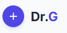

<div align="center">

</div>

Dr. G — AI Symptom Triage Assistant

Created by: Sanket Kumar Kar

A small single-page TypeScript React app (Vite) that helps triage patient symptoms using an LLM-backed service. This README documents the project purpose, architecture, setup, development workflow, data files, and next steps.

## Quick links

- Location: this workspace root
- Live / AI Studio: (if applicable) — add your app link here

## What this project is

Dr. G is an experimental UI for symptom review and triage. It combines a lightweight React + Vite frontend with internal services that call an LLM (Gemini or another provider) and an APSA (symptom engine) implementation. The UI offers chat-style interactions, symptom option chips, sliders for ranges, and a printable report view.

Key goals:
- Rapid prototyping of LLM-driven triage flows
- Maintain a simple, testable, component-based frontend
- Keep data local for offline testing (CSV/JSON symptom dataset)

## Repo layout

Top-level files
- `package.json` — npm scripts and dependencies
- `tsconfig.json` — TypeScript config
- `vite.config.ts` — Vite config
- `index.html`, `index.tsx`, `App.tsx` — app entry
- `types.ts` — shared TypeScript types
- `metadata.json` — app metadata

Key folders
- `components/` — React components
   - `ChatWindow.tsx` — main chat interface
   - `OptionChips.tsx` — selectable symptom chips
   - `RangeSlider.tsx` — slider UI
   - `ReportView.tsx` — printable report of findings
   - `Spinner.tsx` — loading spinner
   - `SymptomReview.tsx` — symptom review flow
   - `icons/DrGLogo.tsx` — logo component
- `services/` — backend-like local services
   - `geminiService.ts` — wrapper for requests to Gemini/LLM provider (expects API key)
   - `apsaEngine.ts` — symptom processing / engine logic

Data
- `mayo_all_letters_symptoms.csv` — CSV symptom dataset used for lookups and tooling
- `mayo_all_letters_symptoms.json` — JSON version of the dataset for fast import

Assets
- `logo.png` — app logo

## Prerequisites

- Node.js (recommend v18+)
- npm (or use pnpm/yarn if you prefer)

## Environment variables

Create a `.env.local` in the project root and add any provider API keys. Example:

```
GEMINI_API_KEY=your_gemini_api_key_here
```

Notes:
- `geminiService.ts` expects an API key in `process.env.GEMINI_API_KEY` (or through your deployment's secret manager).

## How to run (local development)

Follow these steps to run the app locally on Windows (PowerShell examples):

1) Install dependencies

```powershell
npm install
```

2) Create a `.env.local` in the project root and add environment variables (example below):

```powershell
Set-Content -Path .\.env.local -Value "GEMINI_API_KEY=your_gemini_api_key_here"
```

Or create the file with a text editor and paste:

```
GEMINI_API_KEY=your_gemini_api_key_here
```

3) Start the dev server

```powershell
npm run dev
```

4) Open the app in your browser at:

http://localhost:5173

Build for production:

```powershell
npm run build
```

Preview the production build locally:

```powershell
npm run preview
```

## Scripts (common)

Check `package.json` for the exact scripts, but typical commands:
- `npm run dev` — start Vite dev server
- `npm run build` — build production assets
- `npm run preview` — preview the built app

## How the app works (high level)

- The UI components collect symptom inputs (chips, sliders, typed text) and display messages in `ChatWindow`.
- `services/apsaEngine.ts` contains domain logic to interpret user inputs and score/normalize symptoms.
- `services/geminiService.ts` is the thin integration layer between the app and the configured LLM provider. It formats prompts and returns structured responses the UI consumes.

## Important files to inspect when extending

- `types.ts` — use this to find shared types and extend the data models.
- `services/geminiService.ts` — update authentication or prompt formats here if you swap LLMs.
- `services/apsaEngine.ts` — core triage logic lives here.
- `components/SymptomReview.tsx` and `components/ReportView.tsx` — UIs most likely to be modified.

## Data updates

- If you update `mayo_all_letters_symptoms.csv`, regenerate or update the JSON file used by the app. Prefer the JSON file for runtime imports for speed.

## Development notes and assumptions

- Assumption: this is a frontend-only repository that calls external LLM APIs directly from the client. For production, move API keys to a serverless function or backend to avoid exposing secrets.
- Assumption: the project uses Vite + React + TypeScript (inferred from `vite.config.ts`, `.tsx` files, and `tsconfig.json`).
- If you plan to run LLM calls server-side, create an API route and move `geminiService` there.

Edge cases to consider when extending the app:
- Missing or invalid API key (graceful error UI)
- Large symptom lists (virtualize long lists for performance)
- Rate limits and API errors from the LLM provider (retry/backoff)

## Testing and linting

- This repo currently doesn't include automated tests. Add a testing framework (Jest, Vitest) and a couple of unit tests for `apsaEngine.ts` and `geminiService.ts`.
- Add ESLint / Prettier to ensure consistent style.

## Deployment

- Static hosting such as Vercel, Netlify, or GitHub Pages is suitable for the built assets.
- If you use server-side LLM calls, deploy a small serverless function (Vercel Serverless, Netlify Functions, or AWS Lambda) to hold secrets.

## Contribution

1. Fork the repo and create a feature branch.
2. Run the app and add tests for new behavior.
3. Open a pull request describing the change and motivation.

## Next steps / suggestions

- Add a `.env.example` with variable names (no secrets).
- Add basic unit tests for `apsaEngine.ts` (happy path + missing fields).
- Add a server-side proxy for LLM calls to keep API keys secret.

## License

No license specified. Add a `LICENSE` file (for example, MIT) if you want to make the project open source.

## Contact / Author

Keep author and contact info inside `package.json` or add a CONTRIBUTORS file.

---

If you'd like, I can also:
- Add a `.env.example` file.
- Add a minimal test for `apsaEngine.ts` and wire up `vitest`.
- Create a short `CONTRIBUTING.md`.

Tell me which of those you'd like next and I'll implement it.
